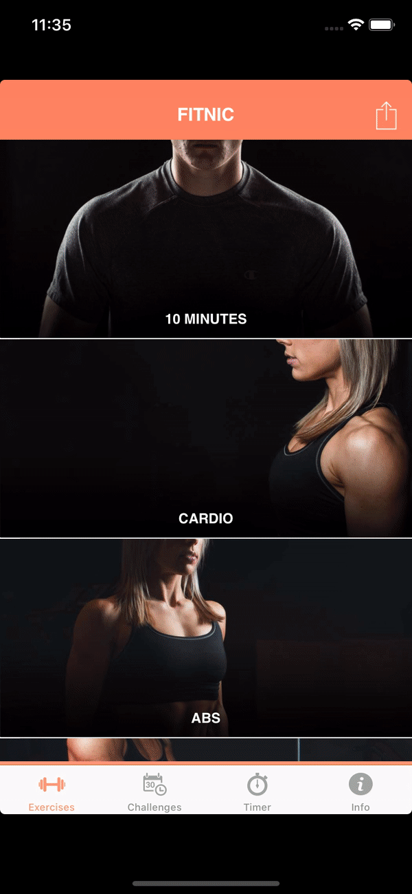

# Fitnic
## _Take your fitness goals to the next level_

Fitnic is an iOS app, powered by swift and firebase.

## Build and Runtime Requirements
+ Xcode 9.0 or later
+ iOS 8.0 or later
+ OS X v10.10 or later

## App Screenshots

  
  
  
  

<!-- 

 -->

## Author

Basila Nathan, basilanathan@gmail.com

